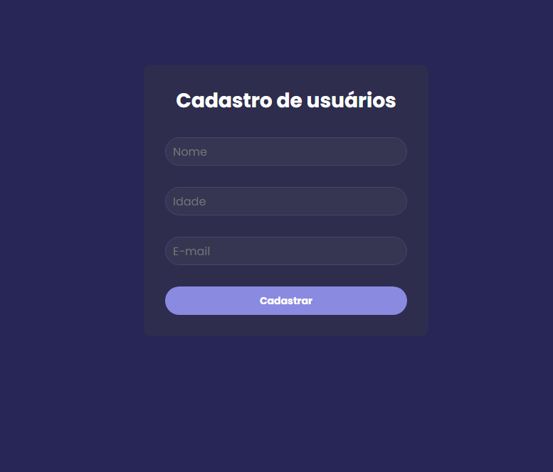

# Cadastro de Usuários

Este projeto é uma aplicação web para cadastro e listagem de usuários. Construída com React e Vite, a aplicação se conecta a uma API de backend para persistir os dados em um banco de dados e exibi-los dinamicamente na tela. O projeto oferece uma interface de usuário reativa e um ambiente de desenvolvimento moderno e rápido.

## 🖼️ Layout



## 🚀 Tecnologias e Bibliotecas Utilizadas

Abaixo estão as principais tecnologias e bibliotecas que compõem este projeto:

### Core
*   **[React](https://react.dev/)**: Biblioteca JavaScript para construir interfaces de usuário. É a base da nossa aplicação.
*   **[Vite](https://vitejs.dev/)**: Ferramenta de build e servidor de desenvolvimento que oferece uma experiência extremamente rápida, com Hot Module Replacement (HMR) instantâneo.

### Requisições HTTP
*   **Axios**: Cliente HTTP baseado em Promises para o navegador e Node.js. Utilizado para fazer a comunicação com a API de backend para criar, ler, atualizar e deletar usuários.

### Ferramentas de Desenvolvimento
*   **ESLint**: Ferramenta de linting para identificar e corrigir problemas no código JavaScript/React, garantindo a qualidade e a padronização do código.
*   **@vitejs/plugin-react**: Plugin oficial que integra o React com o Vite, utilizando Babel para Fast Refresh.

### Dependências do Ecossistema
O projeto também inclui outras dependências que são parte do ecossistema de desenvolvimento JavaScript moderno, trazidas por ferramentas como Vite, ESLint e Axios. Algumas delas são:

*   **Chalk**: Utilizada para estilizar o output de texto no terminal, muito comum em ferramentas de linha de comando.
*   **caniuse-lite**: Uma versão mais leve do banco de dados do `caniuse.com`, usada por outras ferramentas para garantir a compatibilidade com navegadores.
*   **@humanwhocodes/retry**: Utilitário para tentar novamente chamadas assíncronas que falharam, melhorando a resiliência da aplicação.

## 📋 Pré-requisitos

Antes de começar, você vai precisar ter instalado em sua máquina as seguintes ferramentas:
*   Git
*   Node.js
*   Um gerenciador de pacotes como NPM ou Yarn

## ⚙️ Como Executar o Projeto

Siga os passos abaixo para rodar a aplicação em ambiente de desenvolvimento:

```bash
# 1. Clone este repositório
$ git clone <url-do-seu-repositorio>

# 2. Acesse a pasta do projeto no terminal/cmd
$ cd registration-users

# 3. Instale as dependências
$ npm install

# 4. Execute a aplicação em modo de desenvolvimento
$ npm run dev

# O servidor iniciará na porta 5173 (por padrão) - acesse http://localhost:5173
```

## 📜 Scripts Disponíveis

No diretório do projeto, você pode executar:

*   `npm run dev`: Inicia a aplicação em modo de desenvolvimento.
*   `npm run build`: Compila a aplicação para produção na pasta `dist`.
*   `npm run lint`: Executa o ESLint para analisar o código em busca de erros e inconsistências.
*   `npm run preview`: Inicia um servidor local para visualizar a versão de produção (após executar `npm run build`).
